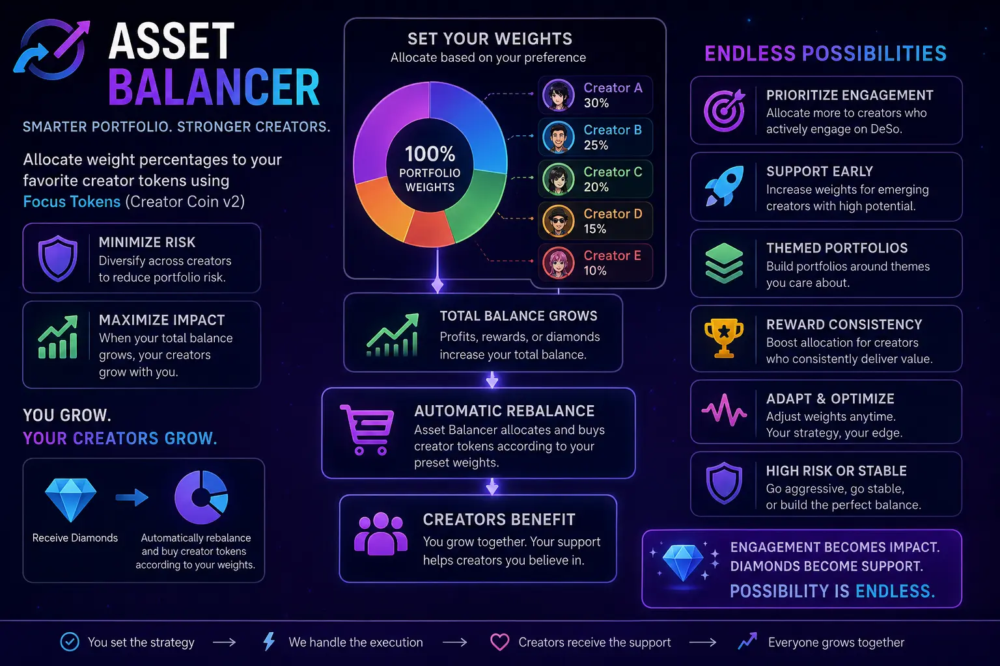

An automated Python portfolio manager for the **DeSo** ecosystem that continuously monitors your wallet and rebalances your holdings according to your target allocation.

The balancer supports **DESO**, **USDC**, **FOCUS**, **OPENFUND**, and **creator coins**. Creator coin allocations are calculated as a percentage of your total **FOCUS** allocation, making it easy to maintain a diversified creator coin portfolio.

## Features

* Automatic portfolio monitoring and rebalancing
* Supports **DESO**, **USDC**, **FOCUS**, and **OPENFUND**
* Automatic creator coin allocation based on your FOCUS allocation
* Configurable target portfolio percentages
* Configurable creator coin weights
* Automatic buy and sell order calculation
* Configurable portfolio check interval
* Maximum slippage protection
* Hard cap protection to prevent excessive purchases
* Minimum transaction amount to avoid unnecessary fees
* Configurable deviation threshold to reduce excessive trading
* Optional automatic trading mode
* Dry-run mode by disabling automatic execution
* Debug logging
* Secure configuration using environment variables
* Designed for long-running unattended execution

---
  
## Supported Assets

| Asset         | Description                                                 |
| ------------- | ----------------------------------------------------------- |
| DESO          | Native DeSo blockchain token                                |
| USDC          | USD Coin stablecoin                                         |
| FOCUS         | FOCUS token                                                 |
| OPENFUND      | OPENFUND token                                              |
| Creator Coins | Creator coins paired with FOCUS |

## Requirements

* Python 3.10+
* pip

## Installation

Clone the repository:

```bash
git clone https://github.com/ropolexi/deso-asset-balancer.git
cd deso-asset-balancer
```

Create a virtual environment:

```bash
python -m venv .venv
```

Activate the virtual environment:

**Linux / macOS**

```bash
source .venv/bin/activate
```

**Windows**

```powershell
.venv\Scripts\activate
```

Install dependencies:

```bash
pip install -r requirements.txt
```

## Configuration

Create a `.env` file:

```env
DESO_SEED="your_deso_seed"
NODE="https://node.deso.org"

UPDATE_INTERVAL=600 #in seconds
DESO_PERCENTAGE=20
FOCUS_PERCENTAGE=6.2
OPENFUND_PERCENTAGE=6.2
TOKENS_BASED_ON_FOCUS = [{"name":"Kaanha","pubkey":"BC1YLhvxVMEUp5y8zpq17VaRE264JX4r4T4XU4Ff8NJ4MrchkGDq4q3","target_percentage":42},{"name":"Arnoud","pubkey":"BC1YLgBND6GqfWYb8HyY3hAm2UpT8aeFv2fX41sMPAu7uuVjuSQtDju","target_percentage":3},{"name":"SeanSlater","pubkey":"BC1YLirtb7CjNwVmWEt7t1487Qpo4LoPBDEGvfqYwXXZcj2dDLNMBVU","target_percentage":3},{"name":"Ryleesnet","pubkey":"BC1YLijd5XEneHzVd5VFb2mgdNkRpPneNWY6fKJ3ptBVJ5guqAnPSke","target_percentage":3}]

MAX_SLIPPAGE = 0.01 # Maximum acceptable slippage to avoid buying or selling at unfavorable prices.
HARD_CAP = 30 # Maximum allowed asset $ value; prevents purchases above this limit.
DEVIATION = 5   # Ignore price changes smaller than this percentage to prevent unnecessary BUY/SELL orders.
MIN_TRANSACTION = 0.01 # to avoid very small $ value transactions and fees

BALANCER_ACTIVE = True # Enable or disable automatic trading
PRINT_DEBUG = False
```
---

## Configuration Options

| Variable                | Description                                                                                                             |
| ----------------------- | ----------------------------------------------------------------------------------------------------------------------- |
| `DESO_SEED`             | Your DeSo wallet seed phrase.                                                                                           |
| `NODE`                  | DeSo node endpoint used for blockchain communication.                                                                   |
| `UPDATE_INTERVAL`       | Time between portfolio checks (seconds).                                                                                |
| `DESO_PERCENTAGE`       | Target portfolio allocation for DESO.                                                                                   |
| `FOCUS_PERCENTAGE`      | Target portfolio allocation for FOCUS.                                                                                  |
| `OPENFUND_PERCENTAGE`   | Target portfolio allocation for OPENFUND.                                                                               |
| `TOKENS_BASED_ON_FOCUS` | List of creator coins paired with FOCUS allocation.                                |
| `MAX_SLIPPAGE`          | Maximum acceptable slippage when executing trades. Trades exceeding this value are skipped.                             |
| `HARD_CAP`              | Maximum USD value allowed for an asset before additional purchases are blocked.                                         |
| `DEVIATION`             | Minimum allocation difference (%) required before a rebalance is triggered.                                             |
| `MIN_TRANSACTION`       | Minimum trade value (USD) to avoid executing very small transactions.                                                   |
| `BALANCER_ACTIVE`       | Enables or disables automatic trade execution. When `False`, the balancer performs calculations without placing trades. |
| `PRINT_DEBUG`           | Enables detailed debug logging.                                                                                         |

---
## Usage

Run the application:

```bash
python balancer.py
```
The application will continue running until stopped, checking your portfolio every `UPDATE_INTERVAL` seconds.

---

# How It Works

During each cycle the balancer:

1. Connects to the configured DeSo node.
2. Fetches current market prices.
3. Retrieves your wallet balances.
4. Calculates the total portfolio value.
5. Ignores allocation differences smaller than `DEVIATION`.
6. Verifies `HARD_CAP`, `MAX_SLIPPAGE`, and `MIN_TRANSACTION` limits.
7. Calculates the required buy and sell orders.
8. Executes trades if `BALANCER_ACTIVE=True`.
9. Waits until the next update cycle.

---

## Project Structure

```text
.
├── balancer.py
├── requirements.txt
├── .env
└── README.md
```


## Safety

Before enabling automatic trading:

* Verify your seed credentials.
* Test using small balances.
* Review the calculated trades.
* Keep your seed secure.
* Never commit your `.env` file to version control.

---

# Safety Features

The balancer includes several safeguards to reduce trading risk:

* Configurable maximum slippage protection
* Hard cap protection to prevent over-allocation
* Minimum transaction size filtering
* Deviation threshold to reduce unnecessary trades
* Optional dry-run mode (`BALANCER_ACTIVE=False`)
* Debug logging for trade calculations
* Secure credential management using environment variables

---

## Best Practices

Before enabling automatic trading:

* Verify your wallet seed.
* Test with small balances first.
* Review the calculated trades.
* Start with `BALANCER_ACTIVE=False` to observe behavior.
* Keep your seed phrase secure.
* Never commit your `.env` file to version control.
  
## Disclaimer

This software is provided **"as is"**, without any warranties or guarantees of any kind, whether express or implied.

Cryptocurrency trading and investing involve significant financial risk. Market conditions, price volatility, liquidity, slippage, software bugs, network issues, or unexpected blockchain behavior may result in partial or complete loss of funds.

By using this software, you acknowledge that:

* You are solely responsible for all trades executed by the application.
* You understand the risks associated with automated cryptocurrency trading.
* You have tested the software and configured it appropriately for your use case.
* You use this software entirely at your own risk.

**The author(s) and contributors accept no liability for any financial losses, loss of funds, damages, or other consequences arising from the use or misuse of this software.** By using this project, you agree that all responsibility for its use rests solely with you.
